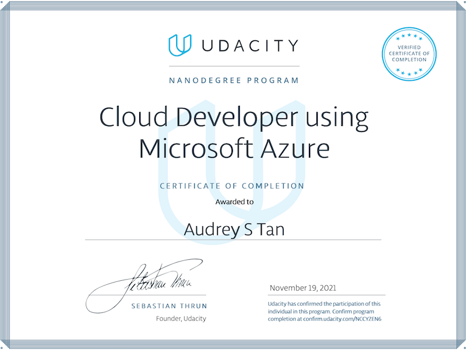
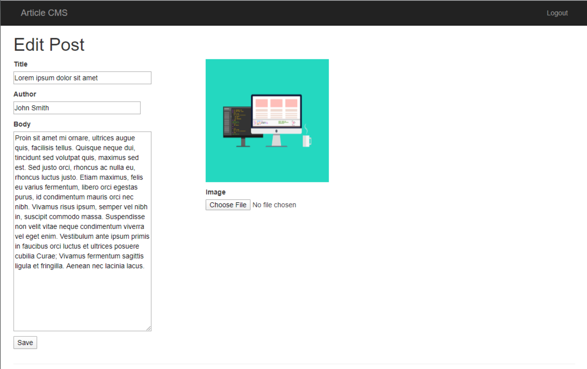
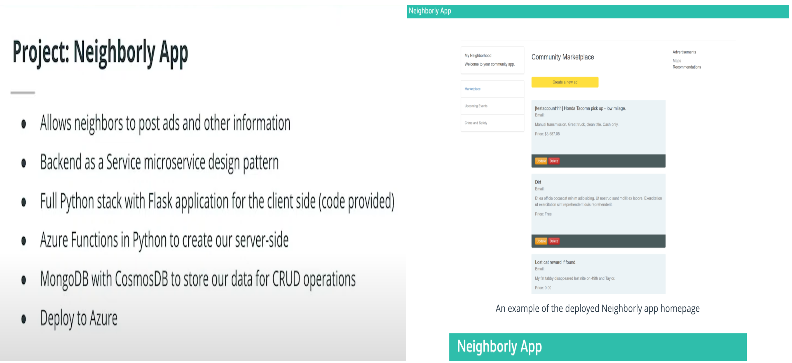
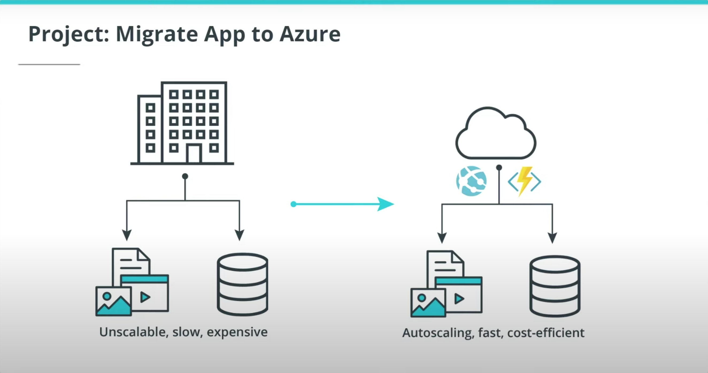
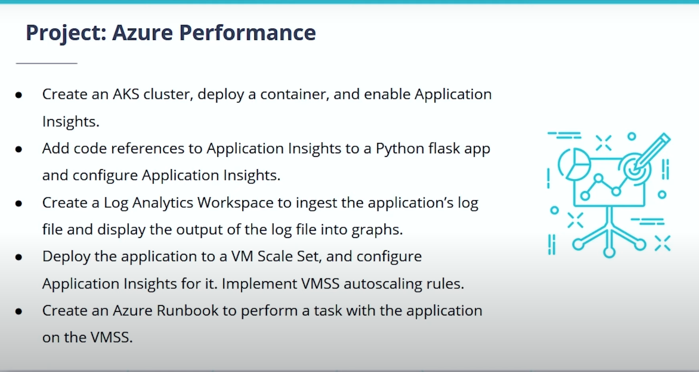

# Cloud Developer for Microsoft Azure Nanodegree (CDMAND), Udacity
I was one of the 300 CNAAND recipients chosen from the 5,000 participants in the _**Introduction to Azure Applications Scholarship Program**_. This repo contains a collection of project deliverables from my CDMAND course work. 
 ---

_*A portion of project code and artifacts are stowed in secured storage to discourage improper access. For legitimate needs, please email to request access*_.

## Project Deliverables Summary
### 1. [Deploy An Article CMS to Azure](https://github.com/atan4583/Cloud-Developer-for-Microsoft-Azure-ND-Project-Portfolio/tree/main/Project1-article-cms)
> * Design, build and deploy an Article Content Management System (`CMS`) with the ability to login/authenticate, read posts, create/save a post, edit/save an existing post. An example article within the deployed CMS is as shown below (**Image credit: Udacity CDMAND Nanodegree**):
>
> 
>
> * Use Microsoft Authentication Library (`MSAL`) to authenticate login from the `CMS` frontend. SQL Server is used to store data added, updated or deleted by the user. 
>
>
> * Project specification: refer to this [rubric](https://review.udacity.com/#!/rubrics/2850/view) 
>
>
> * Project code and artifact repository: click [here](https://github.com/atan4583/Cloud-Developer-for-Microsoft-Azure-ND-Project-Portfolio/tree/main/Project1-article-cms)
> 
>
> * Tool: Azure SQL Server, Storage Container, App Service, Flask, Log Stream, Microsoft Authentication Library, Azure CLI    
>
>
> * Artifact: [screenshots](https://github.com/atan4583/Cloud-Developer-for-Microsoft-Azure-ND-Project-Portfolio/tree/main/Project1-article-cms/screenshots), [WRITEUP.md](https://review.udacity.com/#!/rubrics/2850/view), [config.py](https://drive.google.com/file/d/1bz88JZa8TDmATugwefvEm-67JOn9Y25x/view?usp=sharing), [FlaskWebProject code](https://drive.google.com/drive/folders/1KK8BZJtnG8YVG8lr0xoiwyHdJMbKILvB?usp=sharing)
>
>
> 
 ---
### 2. [Deploying the Neighborly App with Azure Functions](https://github.com/atan4583/Cloud-Developer-for-Microsoft-Azure-ND-Project-Portfolio/tree/main/Project2-NeighborlyApp)
> * Build a python web app named "Neighborly" for local community members to post advertisements for products and services. The app is built on Python Flask micro framework and allows the user to view, create, edit and delete the community advertisements. The project brief is as shown below (**Image credit: Udacity CDMAND Nanodegree**):
>
> 
>
> * Build an `Azure Function App` with functionality to create, update, delete and get advertisements and posts to/from a Mongo DB. Each of these operations is accessible via a web endpoint hooked up to the web app. Dockerize the function app for deployment to Azure. Create a Logic App to monitor HTTP requests and send an email notification whenever the event is triggered. Create a namespace for event hub and add the connection strong to the event hub trigger azure function.     
>
>
> * Project specification: refer to this [rubric](https://review.udacity.com/#!/rubrics/2825/view)
>
>
> * Project code and artifact repository: click [here](https://github.com/atan4583/Cloud-Developer-for-Microsoft-Azure-ND-Project-Portfolio/tree/main/Project2-NeighborlyApp)
> 
> 
> * Tool: Docker, ACR, AKS, MongoDB, Azure App Service, Azure Function tools V3, Azure Event Hub, Azure Logic App, Azure CLI, Flask, Sendgrid  
>
>
> * Artifact: [screenshots](https://github.com/atan4583/Cloud-Developer-for-Microsoft-Azure-ND-Project-Portfolio/tree/main/Project2-NeighborlyApp/screenshots), [NeighborlyAPI](https://drive.google.com/drive/folders/1-jxIL800ROs2JP6ZVdHSINjlcdnaZRtM?usp=sharing), [NeighborlyFrontEnd](https://drive.google.com/drive/folders/1-jxIL800ROs2JP6ZVdHSINjlcdnaZRtM?usp=sharing)
>
>
>
 ---
### 3. [Migrate App to Azure](https://github.com/atan4583/Cloud-Developer-for-Microsoft-Azure-ND-Project-Portfolio/tree/main/Project3-MigrateAppToAzure)
> * Migrate a web application that is not scalable to handle user load at peak to an Azure App Service, with its PostgreSQL database to an Azure Postgres database service and refactor the notification logic to an Azure Function via a service bus queue message. The project brief is as shown below (**Image credit: Udacity CDMAND Nanodegree**):
> 
> 
>
> * Migrate a legacy web app to `Azure App Service`, along with its PostgresSQL database to `Azure Postgres database service`. Port the application notification service to `Azure Function` utilizing `Azure Service Bus Message Queue`. Create a monthly cost analysis report to show the costs and benefits of the migration.   
>
>
> * Project specification: refer to this [rubric](https://review.udacity.com/#!/rubrics/2824/view)
>
>
> * Project code and artifact repository: click [here](https://github.com/atan4583/Cloud-Developer-for-Microsoft-Azure-ND-Project-Portfolio/tree/main/Project3-MigrateAppToAzure)
> 
> 
> * Tool: Postgres, Visual Studio Code, Azure Tools for Visual Studio Code, Azure Function tools V3, Azure CLI, psycopg2, sendgrid 
>
>
> * Artifact: [screenshots](https://github.com/atan4583/Cloud-Developer-for-Microsoft-Azure-ND-Project-Portfolio/tree/main/Project3-MigrateAppToAzure/screenshots), [refactored web code](https://drive.google.com/drive/folders/1FG_h7kE9Siz_R15mwp7Ox8ReKQIt0fRN?usp=sharing), [refactored azure function code](https://drive.google.com/drive/folders/1r9D1QUmyR2KAJXiFNs5UNNTn9LruzNCR?usp=sharing), README.md 
>
>
> 
 ---
### 4. [Enhancing Applications](https://github.com/atan4583/Cloud-Developer-for-Microsoft-Azure-ND-Project-Portfolio/tree/main/Project4-EnhancingApplications)
> * Apply Azure Performance techniques to collect and display application performance and health data. Use the data to make informed decisions about how to diagnose, rectify the application and infrastructure problems. Formulate and automate remediation tasks to handle recurrance of future incidents. The project brief is as shown below (**Image credit: Udacity CDMAND Nanodegree**):
>
> 
>
> * Use Azure Kubernetes Service, VM Scale Sets, Application Insights and Azure Log Analytics to collect application performance and health data. Use the insights gleaned from the data to diagnose and correct application and infrastructure issues. Leverage Runbooks to build self healing remediation workflow to handle incident recurrances.         
>
>
> * Project specification: refer to this [rubric](https://review.udacity.com/#!/rubrics/2892/view)
>
>
> * Project code and artifact repository: click [here](https://github.com/atan4583/Cloud-Developer-for-Microsoft-Azure-ND-Project-Portfolio/tree/main/Project4-EnhancingApplications)
> 
> 
> * Tool: Docker, acr, vmss, aks, application insights, azure monitor, redis, flask, autoscaler, azure automation account, python runbook, az cli
>
>
> * Artifact: [main.py](https://drive.google.com/file/d/1HvWNHnKT3cErJLMIbZ6q1qSduIFU173_/view?usp=sharing), [submission-screenshots](https://github.com/atan4583/Cloud-Developer-for-Microsoft-Azure-ND-Project-Portfolio/tree/main/Project4-EnhancingApplications/submission-screenshots) 
>
>
>
 ---
>
>
